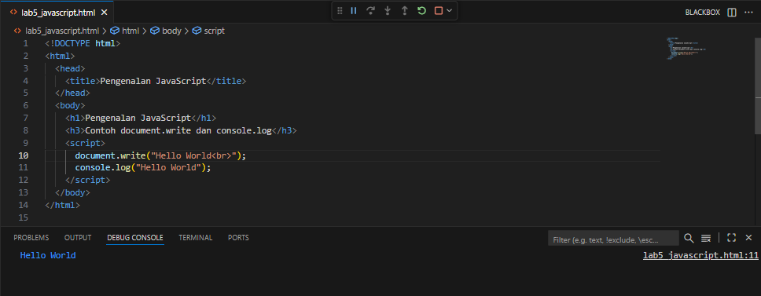
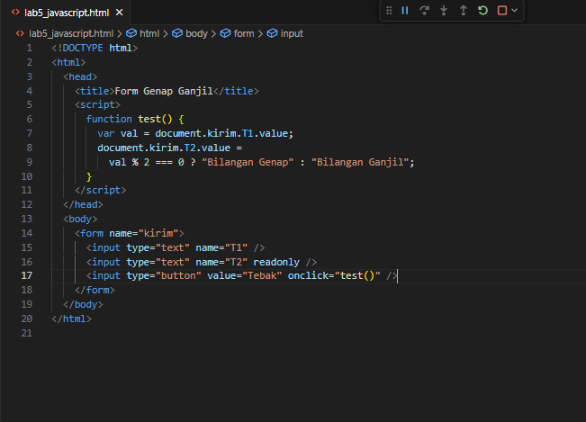
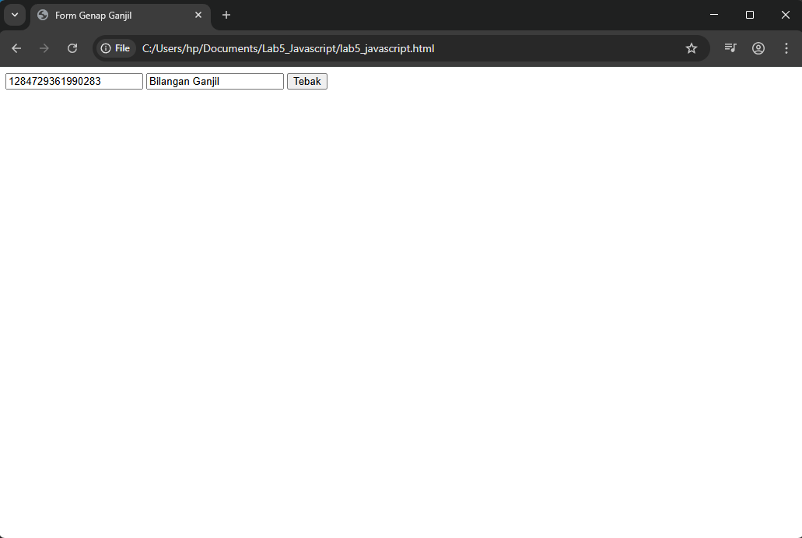

# Lab5_Javascript

Nama  : Sayyid Sulthan Abyan

NIM   : 312410496

Kelas : TI.24.A.5

## Langkah Praktikum

---

### Pengenalan JavaScript  
Menampilkan teks menggunakan document.write() dan console.log().

--

### Alert Box  
Menampilkan pesan pop-up menggunakan alert(). 

---

#### Method
Pemakaian method dalam objek

---

### Prompt Input  
Mengambil input nama dari pengguna dan menampilkannya di halaman.

---

### Fungsi dengan onload  
Menjalankan fungsi saat halaman dimuat menggunakan body onload.  

---

### Operasi Aritmatika  
Menghitung dan menampilkan hasil perkalian, pembagian, penjumlahan, pengurangan, dan modulus.

---

### Seleksi Kondisi (if..else)  
Menentukan kelulusan berdasarkan nilai input.  

---

### Seleksi Kondisi (switch)  
Menentukan bilangan berdasarkan input angka 1–5. 

---

### Form Genap/Ganjil  
Menentukan apakah input bilangan genap atau ganjil.  

---

### Form Button Warna  
Mengubah warna latar belakang dan teks menggunakan tombol, serta menampilkan tanggal terakhir modifikasi halaman.

---

### Checkbox Menu Otomatis  
Menghitung total harga makanan berdasarkan checkbox yang dipilih.  

---

## Pertanyaan dan Tugas
Buat script untuk melakukan validasi pada isian form.

### Validasi Form  
Memastikan input nama tidak kosong sebelum submit.  

---

